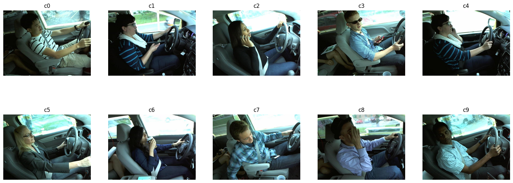

# Distracted driver detection

The ["State Farm Distracted Driver Detection" Kaggle competition](https://www.kaggle.com/competitions/state-farm-distracted-driver-detection) challenges participants to develop robust machine learning models for identifying distracted driving behaviors in images. The dataset consists of a collection of images captured inside vehicles, where drivers are engaged in various activities such as texting, eating, or adjusting the radio. Here's exemplar data:

The primary goal of the competition is to build efficient models capable of accurately classifying the different forms of distracted driving.

My current solution leverages on two phases:

1. **Transfer learning phase**:
    - Use of ResNet50 model (pretrained on ImageNet) with frozen layers to extract features from the distracted driver images.
    - Implements data augmentation to enhance the model's ability to generalize and handle diverse real-world scenarios.
    - Trains the model on the augmented dataset with a sparse categorical cross-entropy loss function and an SGD optimizer.
2. **Fine-Tuning phase**:
    - Unfreezes specific layers for fine-tuning, allowing the model to adapt to the specifics of the distracted driving dataset.
    - Employs an Adam optimizer with a reduced learning rate for fine-tuning.
    - Continues training on the dataset, closely monitoring validation loss and employing early stopping for optimal performance.

Finally, the model is applied to predict classes for test images. The results are saved in a submission csv file ready to be evaluated on the competition platform.

Private score: 0.46;
Public score: 0.60

*Note: The code also includes commented lines for saving the models at various stages if needed.*